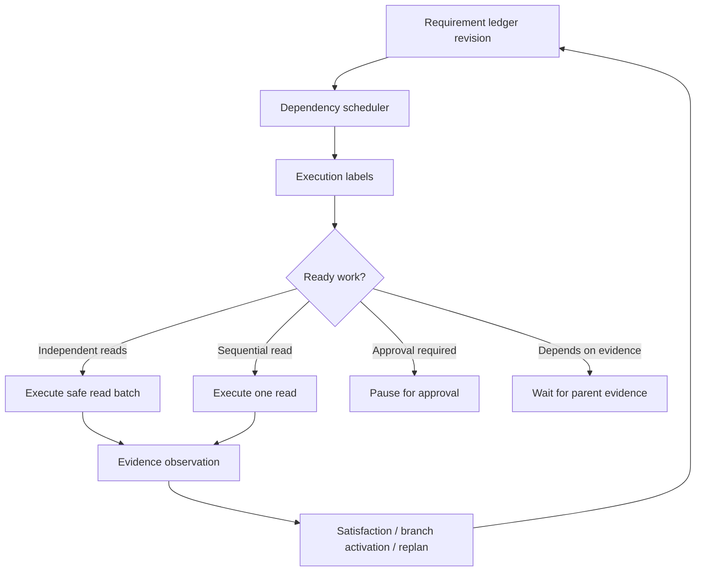

# Planner-Owned Dependency Execution Plan

## Status

Planning document for Plan 3 of hard-case handling.

Plan 3 should start only after the semantic intake compiler is fail-closed for unbound dependent language such as `if present`, `when you see`, `that job`, `related product`, and similar variants. Dependency scheduling depends on trustworthy requirement roles; if intake still creates fake executable requirements, scheduling will only make the wrong work faster.

## Purpose

Plan 1 gave the graph a bounded replan spine after weak or failed evidence. Plan 2 added evidence-driven child requirements. Plan 5 moved query understanding toward semantic intake plus deterministic compilation.

The next weakness is execution ordering. The graph can now represent parent/child and conditional work, but it still lacks a clear dependency execution contract for deciding which requirements can run together, which must wait for evidence, and which must pause for approval.

Plan 3 adds a dependency-aware execution Module that labels requirements and tool calls before execution.

## Confirmed Implementation Decisions

Use these defaults for Plan 3 unless a later audit finds a concrete blocker.

| Decision | Confirmed Default | Reason |
|---|---|---|
| Parallel execution rollout | Label and enforce readiness first; enable parallel read batches later in Phase 5. | Correctness must be proven before speed. |
| Max parallel read batch size | `3` | Enough to prove batching without making failures noisy. |
| Batch eligibility | Read-only API tools, bounded single-entity reads, same source of truth, no approval, no mutation, no unbounded collection/search. | Keeps the first batching policy small and safe. |
| Child/follow-up requirements | Always depend on active parent evidence. | Child work must not run before the referent exists. |
| Approval/mutation work | Always sequential and waits for read prerequisites. | Approval work must not share a parallel group or bypass evidence checks. |
| Plan 3 UI scope | API/snapshot dependency diagnostics only. Full investigation trace UI waits for Plan 4. | Avoid building frontend trace against unstable backend concepts. |
| Worktree discipline | Start from a clean or intentionally staged/committed worktree. | Prevents Phase 5 cleanup and Plan 3 changes from mixing. |
| Test order | Backend scheduler contract, graph execution gate, API/snapshot diagnostics, seeded Playwright, browser validation. | Proves behavior from the deepest contract up to user-visible flow. |

## Problems This Plan Solves

| Problem | Current Risk | Target Behavior |
|---|---|---|
| Independent reads run as ordinary sequential work | Multi-entity read tasks can be slower and harder to inspect. | Independent read-only requirements can run as a safe batch. |
| Dependent reads can look like normal open work | A child/follow-up may execute before its parent evidence exists. | Evidence-dependent work waits until the referenced evidence is active. |
| Approval work can mix with reads too early | Mutations might be planned before read prerequisites are verified. | Approval-required work is serialized behind required reads and safety checks. |
| Replan and expansion state are hard to schedule | New child requirements need fresh ordering after each ledger revision. | Scheduler recomputes active dependency labels after every ledger revision. |
| UI trace cannot explain why a step waited | User sees tool calls but not why they were grouped or delayed. | Snapshot/API exposes requirement -> dependency label -> action -> evidence. |

## Non-Goals

- Do not convert the graph to pure ReAct.
- Do not let the LLM directly choose execution order without deterministic validation.
- Do not run mutation/write/approval steps in parallel with other steps.
- Do not bypass locked constraints, failed-tool memory, stale-evidence filters, or approval gates.
- Do not add a new tool selector, RAG stack, approval system, or response renderer.
- Do not hardcode prompt text, seeded IDs, exact tool names, or UI strings in production logic.
- Do not make real LLM behavior mandatory for the default test suite.

## Maintainability Rules

Every fix in Plan 3 must be general enough to cover the behavior class, not only the first failing test.

- Do not add branches keyed to exact prompts, seeded scenario ids, seeded entity ids, exact tool names, or UI copy.
- Prefer typed state and contracts over phrase checks. If phrase handling is needed, keep it in intake/parser policy and prove it with several wording variants.
- Keep dependency scheduling in one scheduler Module. Do not duplicate readiness logic across graph nodes, response rendering, seeded adapters, and tests.
- Use capability/tool metadata for batching decisions: read-only, source of truth, endpoint shape, approval requirement, required args, and side-effect level.
- Make execution-gate enforcement depend on the dependency plan plus existing tool-call validation, not on scenario-specific shortcuts.
- Preserve locality: a future dependency label change should be made in the scheduler/validator, not spread through many call sites.
- Tests must verify behavior through graph/API/oracle interfaces, not private helper shape, unless the helper is the public scheduler Interface for this plan.
- Add at least one variant test for every new rule. Example: if unbounded collection is blocked from batching, test both a jobs collection and another collection-like read when feasible.
- Do not weaken existing hardcode guardrails, approval gates, locked constraints, failed-tool memory, stale-evidence filters, semantic-intake fail-closed behavior, or response-document contracts.
- Prefer fail-closed diagnostics over silent fallback when a dependency label cannot be proven.

## Target Model

Each open requirement gets an execution dependency label:

| Label | Meaning | Can Execute Now | Can Batch |
|---|---|---:|---:|
| `independent_read` | Read-only requirement with bounded constraints and no unmet dependency. | Yes | Yes, with other safe reads |
| `depends_on_evidence` | Requirement needs active evidence from another requirement or branch. | No, until evidence exists | No |
| `approval_required` | Mutation or approval work that needs user confirmation. | No, until approval gate | No |
| `sequential_read` | Read-only but order matters or result should not be batched. | Yes | No |
| `blocked` | Missing referent, missing tool, unsafe state, or validation failure. | No | No |
| `satisfied_or_terminal` | Already complete, skipped, failed, impossible, or superseded. | No | No |

Target flow:



## Dependency Contract

Add a structured dependency plan to graph state diagnostics and API snapshots.

Suggested fields:

```json
{
  "ledger_revision": 3,
  "requirements": [
    {
      "requirement_id": "req-001",
      "label": "independent_read",
      "depends_on_requirement_ids": [],
      "depends_on_evidence_refs": [],
      "ready": true,
      "batch_key": "read:operational_state:job"
    }
  ],
  "ready_groups": [
    {
      "group_id": "group-001",
      "mode": "parallel_read_batch",
      "requirement_ids": ["req-001", "req-002"]
    }
  ],
  "blocked": []
}
```

The dependency plan is advisory until validated at the execution gate. A selected tool call can execute only if the current dependency plan says its requirement is ready and the existing decision/tool validation also passes.

## Safety Invariants

- Only read-only API/RAG calls can be batched.
- Approval-required or mutating calls are never batched.
- A child requirement created from evidence must depend on that evidence or parent requirement.
- A conditional branch is not executable; only its activated child requirement can execute.
- Stale evidence cannot satisfy dependency readiness.
- Removed, superseded, failed, blocked, skipped, or satisfied requirements cannot authorize new tool execution.
- Failed tool memory still applies inside a ready group.
- Replanning recomputes dependency labels from the current ledger revision.

## Phase 0: Baseline Proof

### Goal

Prove current execution ordering does not have a first-class dependency plan.

### Tests

Add backend tests that inspect graph state through public graph execution:

- `test_dependency_plan_baseline_missing_for_independent_reads`
- `test_dependency_plan_baseline_missing_for_child_evidence_dependency`

Expected initial failure:

- No structured dependency plan appears in execution diagnostics.
- Child requirements rely on ad hoc graph routing rather than a visible dependency label.

## Phase 1: Dependency Contract

### Goal

Add dependency-plan contract types without changing execution behavior.

### Implementation

- Add dependency label models to `v2_contracts.py`.
- Add a scheduler Module with a small Interface: current graph state in, dependency plan out.
- Store the dependency plan in `execution_trace.diagnostics`.
- Expose it in the API intent contract and snapshot diagnostics.

### Tests

- `test_dependency_scheduler_labels_satisfied_and_terminal_requirements_not_ready`
- `test_dependency_scheduler_labels_child_requirement_depends_on_parent_evidence`
- `test_dependency_scheduler_labels_mutation_as_approval_required`

## Phase 2: Independent Read Readiness

### Goal

Detect independent read requirements that can safely run without waiting for each other.

### Implementation

- Label read-only requirements with bounded constraints as `independent_read`.
- Label broad collection reads as `sequential_read` unless the result cardinality and display contract are safe to batch.
- Add batch grouping only for same safety class and compatible source of truth.

### Tests

- `test_independent_machine_and_job_reads_are_ready_together`
- `test_unbounded_collection_read_is_not_batched_with_single_entity_reads`
- `test_document_and_api_reads_do_not_batch_unless_supported_by_contract`

## Phase 3: Evidence Dependency Readiness

### Goal

Ensure dependent requirements wait for active evidence before tool retrieval or execution.

### Implementation

- Use `depends_on`, `parent_requirement_id`, `derived_from_evidence_refs`, and conditional branch metadata.
- Treat evidence refs as ready only when active for the current revision.
- Recompute readiness after branch activation and replan.

### Tests

- `test_child_requirement_waits_until_parent_evidence_is_active`
- `test_child_requirement_with_stale_parent_evidence_is_not_ready`
- `test_conditional_branch_false_has_no_ready_child_work`

## Phase 4: Execution Gate Enforcement

### Goal

Make dependency labels enforceable, not just diagnostic.

### Implementation

- Before `choose_tool` and `execute_tool`, require the dependency plan to mark the requirement ready.
- Reject selected tool calls for blocked, terminal, stale-revision, or evidence-dependent-not-ready requirements.
- Preserve safe final failure instead of looping if no requirements are ready.

### Tests

- `test_decision_gate_rejects_tool_for_requirement_waiting_on_evidence`
- `test_decision_gate_rejects_tool_for_terminal_requirement`
- `test_no_ready_requirements_with_open_dependency_fails_or_waits_with_clear_diagnostic`

## Phase 5: Parallel Read Batch Execution

### Goal

Use the dependency plan to run safe independent reads as a batch.

### Implementation

- Build `execute_parallel_read_batch` decisions from ready groups.
- Cap each ready group at `3` calls.
- Preserve existing validator rules: read-only only, no approval tools, no critical side effects, no write conflicts.
- Keep per-call evidence refs and satisfaction checks requirement-scoped.
- Only batch bounded single-entity API reads with the same `source_of_truth`.
- Do not batch broad collection reads, document searches, mutations, approvals, or uncertain safety tools.

### Tests

- `test_independent_read_group_executes_parallel_batch`
- `test_parallel_read_batch_caps_at_three_calls`
- `test_parallel_batch_preserves_requirement_scoped_evidence`
- `test_parallel_batch_does_not_include_approval_or_mutation_tool`
- `test_unbounded_collection_read_is_not_parallel_batched`

## Phase 6: Approval And Mutation Serialization

### Goal

Keep write work behind read prerequisites and approval gates.

### Implementation

- Label mutation/approval requirements as `approval_required`.
- Require prerequisite reads to be satisfied before staging approval.
- Ensure approved resume recomputes dependency plan before executing the write.

### Tests

- `test_approval_requirement_waits_for_read_prerequisite`
- `test_approved_resume_recomputes_dependency_plan`
- `test_mutation_never_shares_parallel_group_with_read`

## Phase 7: API, UI, And E2E Proof

### Goal

Make dependency decisions visible and reproducible.

### API / Snapshot

Expose:

- dependency labels per requirement
- ready groups
- blocked dependency reasons
- batch execution ids
- evidence refs that satisfied dependencies

Do not build the full frontend investigation trace in this plan. Plan 3 should only expose enough API/snapshot structure for Plan 4 to render later.

### Seeded Playwright Scenarios

Add or strengthen:

- `HQ-DEPENDENCY-INDEPENDENT-READ-BATCH`
- `HQ-DEPENDENCY-CONDITIONAL-CHILD-WAITS`
- `HQ-DEPENDENCY-APPROVAL-WAITS-FOR-READ`

### Browser Proof

Use Browser/Playwright to confirm:

- independent reads show as one clear grouped read batch
- child reads appear only after parent evidence
- approval-required actions show after read evidence, not before
- UI does not show fake backwards/reordered activity

## Required Validation Gates

Backend dependency contract:

```powershell
cd factory-agent
python -m pytest tests/test_planner_owned_dependency_scheduler.py -q
```

Graph execution:

```powershell
cd factory-agent
python -m pytest tests/test_planner_owned_graph_execution_observation.py tests/test_planner_owned_graph_llm_proposer.py tests/test_planner_owned_graph_api_contract.py -q
```

Existing guardrails:

```powershell
cd factory-agent
python -m pytest tests/test_planner_owned_satisfaction.py tests/test_hardcode_guardrails.py::test_frontend_phrase_based_state_fallbacks_stay_allowlisted -q
```

Seeded Playwright:

```powershell
cd "eMas Front"
npm run test:e2e -- --project=chromium-seeded --grep "HQ-DEPENDENCY|HQ-SEMANTIC-INTAKE|HQ-REQUIREMENT-EXPANSION|HQ-REPLAN-SPINE"
```

## Final Acceptance

Plan 3 is complete only when:

- every open requirement has a dependency label,
- the execution gate rejects calls for not-ready requirements,
- independent safe reads can run in a validated batch,
- evidence-dependent children wait for active parent evidence,
- approval-required work never runs in parallel or before prerequisites,
- diagnostics survive API/snapshot serialization,
- seeded Playwright proves at least one independent batch, one evidence-dependent child, and one approval-gated sequence.
