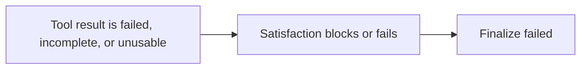
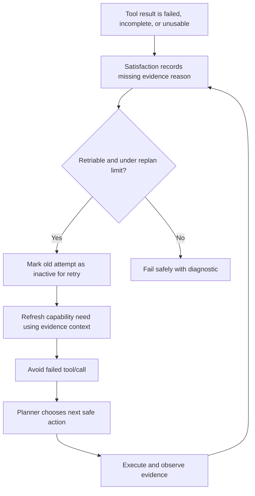

# Planner-Owned Replan Spine Plan

## Status

Planning document for Plan 1 of hard-case handling.

This plan is intentionally narrower than a full ReAct conversion. It keeps the current planner-owned LangGraph architecture and adds a bounded replan spine only when evidence observation and satisfaction prove the current attempt is not enough.

## Summary

Current behavior is strong for normal controlled workflows:

- Build requirement ledger.
- Retrieve a bounded tool window.
- Choose a tool.
- Execute through graph-authorized adapters.
- Observe typed evidence.
- Check satisfaction.
- Finalize, fail, or pause for approval.

The main weakness for hard cases is that the graph does not yet have a real evidence-driven recovery path after a failed, blocked, or incomplete attempt. If the first result reveals a new need, missing field, transient upstream failure, or unusable evidence, the runtime tends to continue toward failed finalization instead of asking for the next safe action.

Plan 1 fixes that specific weakness.

## Scope

Included in Plan 1:

| Item | Included | Reason |
|---|---:|---|
| Missing evidence reasons | Yes | Satisfaction must explain why the requirement is not complete. |
| Bounded replan loop | Yes | The graph needs one controlled path back to planning after unsatisfied evidence. |
| Evidence-aware capability refresh | Yes | The next retrieval must include what was learned from evidence and blockers. |
| Failed tool memory | Yes | The planner/retriever must avoid repeating the same failed call without a changed state. |
| Child requirements | No | Too invasive for Plan 1; save for Plan 2. |
| Dependency labels | No | Useful later, but not required for the first replan spine. |
| Frontend investigation trace UI | No | Do after backend state shape stabilizes. |

## Requirement Anchoring Risk

The current system creates an initial requirement ledger before the planner chooses tools. That is useful, but it can also anchor the rest of the run to a wrong split, wrong label, or over-confident inferred intent.

Plan 1 only partially mitigates this risk. It gives the graph a way to recover when evidence proves the current attempt is weak, missing, failed, or unusable. It does not fully solve wrong initial requirement modeling.

| Risk | Plan 1 Coverage | Best Owner |
|---|---|---|
| Wrong initial split | Partial: replan can recover after missing evidence, but does not redesign the split. | Plan 2 |
| Wrong requirement label | Partial: evidence can force retry or alternate tool search. | Plan 2 |
| Over-locked inferred details | Not fully solved; Plan 1 must avoid making this worse. | Plan 2 |
| Tool narrowing caused by weak req label | Partial: evidence-aware retrieval can search again with failure context. | Plan 1 and Plan 2 |
| Root-cause investigation needing new branches | Not solved in Plan 1. | Plan 2 |
| User-visible explanation of requirement/action/evidence path | Not solved in Plan 1. | Plan 4 |

Plan 1 guardrail: locked user-stated facts must remain protected, but replan logic should treat inferred labels and weak evidence as recoverable. Do not add stronger locking to inferred requirement labels in this plan.

## Non-Goals

- Do not convert the whole agent to pure ReAct.
- Do not add child requirement IDs such as `req-001.a`.
- Do not make the LLM the unrestricted runtime controller.
- Do not weaken locked requirement constraints.
- Do not bypass approval gates for writes.
- Do not add a second tool selector, RAG stack, approval system, or response renderer.
- Do not rely on real LLM behavior for the main acceptance tests.

## Current Checks Performed

These checks were performed before writing this plan:

| Checked Item | Evidence |
|---|---|
| Current graph is fixed-order, not evidence-looping | `factory-agent/factory_agent/graph/v2_agent_graph.py` has linear edges from `satisfaction_node` to `approval_node` to `finalize_node`. |
| LLM/proposer is called only at bounded planner nodes | `planner_decision_node` and `planner_choose_tool_node` call `_propose_and_record_planner_decision`. |
| Satisfaction already records blockers/checks | `factory-agent/factory_agent/planning/v2_satisfaction.py` updates requirement status, blockers, evidence refs, and satisfaction checks. |
| Failed tool evidence currently terminalizes the requirement | `test_phase5_failed_tool_execution_does_not_satisfy_requirement` expects failed requirement and failed final validation. |
| Existing graph tests are the best first layer | `factory-agent/tests/test_planner_owned_graph_execution_observation.py`, `test_planner_owned_satisfaction.py`, and `test_planner_owned_graph_shell_contract.py` already exercise graph state, evidence, satisfaction, and final validation. |
| Existing Playwright seeded lane can provide later proof | `eMas Front/e2e/specs/full-stack-hard-query.spec.js` and seeded tool faults already support deterministic full-stack hard-query scenarios. |

## Target Behavior

Current hard-case path:



Target Plan 1 path:



## Test Philosophy

Plan 1 must be test-first.

Do not write all tests first. Use vertical slices:

1. Write one failing behavior test.
2. Implement the minimum code to pass it.
3. Refactor only while green.
4. Move to the next behavior test.

The main tests should use deterministic graph/adapters. Real LLM proof belongs at the end as smoke coverage, not as the primary development driver.

## Phase 0: Baseline And Failing-Proof Setup

### Goal

Confirm the current behavior fails the new hard-case expectation before implementation starts.

### Tests To Run Before Editing

```powershell
cd factory-agent
python -m pytest tests/test_planner_owned_satisfaction.py tests/test_planner_owned_graph_execution_observation.py tests/test_planner_owned_graph_shell_contract.py -q
```

### New Failing Test

Add the first failing test in:

```text
factory-agent/tests/test_planner_owned_graph_execution_observation.py
```

Suggested name:

```text
test_replan_spine_retries_after_retriable_missing_evidence_and_then_satisfies
```

Behavior to prove:

- First graph-authorized read returns typed but unusable evidence.
- Satisfaction records why the evidence is not enough.
- Graph does not finalize failed immediately.
- Graph replans once.
- Second read returns valid typed evidence.
- Final validation passes.

### Pass Criteria

- Test fails before implementation for the right reason: no replan spine exists.
- Existing focused tests still pass before the new red test is added.

## Phase 1: Missing Evidence Reasons

### Weakness Solved

Satisfaction currently updates statuses and blockers, but the next planner turn needs a compact, structured reason list. Without this, replanning is vague and may repeat the same action.

### Red Test

Add or update a satisfaction-level test in:

```text
factory-agent/tests/test_planner_owned_satisfaction.py
```

Suggested name:

```text
test_satisfaction_records_replan_ready_missing_evidence_reasons
```

Behavior to prove:

- Blocked/failed/open requirements expose structured missing evidence reasons.
- Each reason includes at least:
  - `requirement_id`
  - `status`
  - `reason`
  - `retriable`
  - `evidence_refs`
  - `failed_checks`

### Implementation Target

Prefer adding diagnostics under:

```text
state.execution_trace.diagnostics["satisfaction"]["missing_evidence_reasons"]
```

or a similarly explicit diagnostics key.

### Acceptance

- Missing reasons are derived from existing requirement status, blockers, and satisfaction checks.
- No new LLM call is required.
- Existing final validation behavior does not change yet.

## Phase 2: Bounded Replan Loop

### Weakness Solved

The graph currently flows from satisfaction to approval/finalize. It needs one controlled route back to planning when evidence is retriable and requirements are not satisfied.

### Red Test

Add graph-level test in:

```text
factory-agent/tests/test_planner_owned_graph_execution_observation.py
```

Suggested name:

```text
test_replan_spine_routes_unsatisfied_retriable_requirement_back_to_planner
```

Behavior to prove:

- The graph visits planner/retrieval/choice/execution more than once for the same original user request.
- Replan count is recorded in graph diagnostics.
- Replan stops after success.
- Final validation passes only after active evidence satisfies the requirement.

### Implementation Target

Add conditional graph routing after `satisfaction_node`:

```text
satisfaction_node -> planner_decision_node when replan is needed
satisfaction_node -> approval_node otherwise
```

Use an explicit max attempt guard. Prefer a graph-specific setting/diagnostic derived from current limits rather than unlimited recursion.

### Acceptance

- No infinite loop.
- No `GraphRecursionError`.
- No approval bypass.
- Successful simple read still follows the existing one-pass path.

## Phase 3: Retry State And Stale Attempt Policy

### Weakness Solved

Current helper checks such as `_has_evidence_for_requirement` treat active evidence as enough to stop new retrieval. Failed or blocked evidence can prevent retry unless the graph marks it inactive or treats it as retry history.

### Red Test

Add graph-level test:

```text
test_replan_spine_marks_retriable_bad_evidence_inactive_before_retry
```

Behavior to prove:

- First bad evidence remains in historical evidence ledger.
- First bad evidence is excluded from active satisfaction after replan.
- Requirement can return to `open` for retry without dropping locked constraints.
- Final response uses only active successful evidence.

### Implementation Target

Use existing stale-work patterns where possible:

```text
diagnostic_metadata["active_revision_satisfaction"] = False
diagnostic_metadata["stale_after_graph_replan"] = True
diagnostic_metadata["superseded_reason"] = "replan_spine_retry"
```

The exact names can differ, but the behavior must be explicit and serializable.

### Acceptance

- Historical evidence is preserved for audit.
- Active final evidence excludes stale retry attempts.
- Requirement locked constraints are preserved.

## Phase 4: Evidence-Aware Capability Refresh

### Weakness Solved

The next tool search must know why the prior attempt failed. Otherwise the retriever/planner may choose the same unhelpful route.

### Red Test

Add retriever/graph test:

```text
test_replan_spine_passes_missing_evidence_context_to_tool_retrieval
```

Behavior to prove:

- On the second retrieval, `context_refs` includes missing evidence reasons.
- `context_refs` includes active/historical evidence distinction.
- Capability need includes a replan reason, not only the original query.

### Implementation Target

Extend `PlannerOwnedAgentGraphAdapters.retrieve_tools` context:

```text
context_refs = {
  "original_user_query": ...,
  "graph_phase": ...,
  "missing_evidence_reasons": ...,
  "failed_tool_calls": ...,
  "replan_attempt": ...
}
```

### Acceptance

- Tool retrieval receives enough context for the next decision.
- Existing retrieval tests still pass.
- No full OpenAPI catalog is exposed to the planner proposer.

## Phase 5: Failed Tool Memory

### Weakness Solved

If a tool fails, the next planner/retriever turn must not blindly repeat the same failed call unless state changed or no alternative exists.

### Red Test

Add graph-level test:

```text
test_replan_spine_avoids_repeating_failed_tool_when_alternate_candidate_exists
```

Behavior to prove:

- First selected tool fails.
- Failed tool/call is recorded.
- Second choice uses an alternate candidate when available.
- If no alternate candidate exists, the graph stops safely at max attempts.

### Implementation Target

Record failed call memory in diagnostics:

```text
state.execution_trace.diagnostics["replan_spine"]["failed_tool_calls"]
```

At minimum include:

- `tool_name`
- `args`
- `requirement_id`
- `evidence_ref`
- `reason`
- `attempt`

### Acceptance

- Same failed call is not repeated without a state change.
- Failed call memory is persisted in graph state.
- Read-only retries remain allowed when the previous failure is transient and no better alternative exists, but only under the max attempt limit.

## Phase 6: Replan Limit And Safe Failure

### Weakness Solved

A replan loop must prove it can stop. Hard cases should fail safely instead of looping or producing fake success.

### Red Test

Add graph-level test:

```text
test_replan_spine_stops_at_max_attempts_with_safe_failure_diagnostic
```

Behavior to prove:

- Tool keeps returning retriable bad evidence.
- Graph attempts only the configured maximum.
- Final validation fails.
- Response document is failed/diagnostic.
- Diagnostics include `replan_limit_reached`.

### Acceptance

- No recursion-limit crash.
- No final success without satisfying evidence.
- Failure reason is visible in response document diagnostics.

## Phase 7: API Persistence Proof

### Weakness Solved

Graph behavior is not enough. The session contract must retain enough evidence for snapshots, audits, and frontend debugging.

### Red Test

Add runtime/API test near existing planner-owned API contract coverage:

```text
factory-agent/tests/test_planner_owned_graph_api_contract.py
```

Suggested name:

```text
test_replan_spine_persists_attempts_and_active_evidence_in_intent_contract
```

Behavior to prove:

- `session.replan_context["intent_contract"]` includes graph replan diagnostics.
- Active final evidence excludes stale failed attempt.
- Historical evidence remains present for audit.
- Final user-visible plan/response does not claim success from stale evidence.

### Acceptance

- Persisted contract is enough to debug the replan sequence.
- Existing snapshot/final-response contracts stay compatible.

## Phase 8: Seeded Playwright Reliability Proof

### Purpose

This is not the first development driver. Add it after backend tests pass.

The current single scenario idea is a good smoke, but it is not enough as the only end-to-end proof. Plan 1 needs one success recovery scenario and one safe-failure scenario so the browser lane proves both sides of the replan spine.

### Test Target

Use the seeded hard-query lane:

```text
eMas Front/e2e/specs/full-stack-hard-query.spec.js
eMas Front/e2e/support/hardQueryScenarios.js
```

Suggested scenario:

```text
HQ-REPLAN-SPINE-READ-RECOVERY
```

Behavior to prove:

- Controlled first read failure or incomplete evidence happens.
- Backend replans and succeeds with active evidence.
- Snapshot timeline/final response shows the successful active result.
- UI does not show stale failed evidence as the answer.
- No fake success text appears.

Add a second scenario:

```text
HQ-REPLAN-SPINE-LIMIT-SAFE-FAILURE
```

Behavior to prove:

- Controlled read failure or incomplete evidence repeats until the configured replan limit.
- Backend stops safely with a failed/diagnostic response document.
- Snapshot and visible UI include a safe failure message.
- No `GraphRecursionError`, recursion-limit text, or fake success appears.
- No mutation or approval path is created for the read-only recovery case.

### Oracle Requirements

Extend the hard-query oracle only if the existing expected fields cannot prove these facts. Prefer a small `expected.replanSpine` block rather than phrase-matching runtime text.

Suggested expected shape:

```js
replanSpine: {
  minAttempts: 2,
  maxAttempts: 3,
  requiresMissingEvidenceReason: true,
  requiresFailedToolMemory: true,
  requiresStaleAttemptEvidence: true,
  requiresActiveFinalEvidence: true,
  forbiddenFinalEvidenceRefs: ['first_failed_attempt'],
}
```

The exact field names may change during implementation, but the oracle must prove behavior through the public snapshot/intent contract:

- replan attempts happened,
- missing evidence reasons were persisted,
- failed tool memory was persisted,
- stale attempt evidence did not become the final answer,
- active final evidence did become the answer,
- the browser-visible response agrees with the backend contract.

### Command

```powershell
cd "eMas Front"
npm run test:e2e -- --project=chromium-seeded --grep "HQ-REPLAN-SPINE"
```

### Acceptance

- Full stack uses real local Factory Agent and seeded Go API.
- Deterministic seeded adapters are allowed.
- No real LLM required for this proof.
- At least one scenario proves successful recovery.
- At least one scenario proves bounded safe failure.
- The oracle checks backend snapshot/intent contract and visible DOM, not only final assistant text.

## Phase 9: Optional Real LLM Smoke

### Purpose

This is a non-default smoke test to prove the real planner proposer can use the new replan context.

### Test Shape

Add one opt-in test or manual smoke command that:

- enables the real OpenAI-compatible planner proposer,
- runs a prompt that produces missing evidence or a controlled tool failure,
- confirms the proposer returns a valid next decision after observing replan context.

### Acceptance

- Not part of the default PR gate at first.
- Must be clearly marked as real-provider or local-model smoke.
- Must not be required for deterministic development.

## Final Gate

Before Plan 1 is considered complete:

```powershell
cd factory-agent
python -m pytest tests/test_planner_owned_satisfaction.py tests/test_planner_owned_graph_execution_observation.py tests/test_planner_owned_graph_shell_contract.py tests/test_planner_owned_graph_api_contract.py -q
```

Then, if the seeded browser scenario is added:

```powershell
cd "eMas Front"
npm run test:e2e -- --project=chromium-seeded --grep "HQ-REPLAN-SPINE"
```

## Final Verification: Playwright Browser Confirmation

After the automated backend and seeded Playwright gates pass, do one interactive browser confirmation with Playwright. This is a final confidence check, not a replacement for deterministic tests.

### Goal

Confirm the implemented behavior in the actual chat UI:

- user sends a hard read prompt,
- first attempt fails or returns incomplete evidence through a controlled seeded fault,
- graph replans,
- final visible answer is based on active evidence only,
- stale failed evidence is not presented as success,
- safe-failure scenario stops cleanly at the limit.

### Manual Browser Steps

Use the seeded stack and a headed Playwright run or the in-app browser automation:

```powershell
cd "eMas Front"
npm run test:e2e -- --project=chromium-seeded --grep "HQ-REPLAN-SPINE-READ-RECOVERY" --headed
```

Then confirm:

1. Open the Factory Agent chat.
2. Send the recovery scenario prompt.
3. Wait until the session reaches `COMPLETED`.
4. Inspect the latest assistant response and activity timeline.
5. Confirm the response shows the second active successful evidence.
6. Confirm no visible text claims success from the first failed attempt.
7. Open or fetch the session snapshot and confirm the intent contract contains replan diagnostics.

Run the safe-failure scenario:

```powershell
cd "eMas Front"
npm run test:e2e -- --project=chromium-seeded --grep "HQ-REPLAN-SPINE-LIMIT-SAFE-FAILURE" --headed
```

Then confirm:

1. The session reaches `FAILED` or the expected safe diagnostic terminal state.
2. The response document is diagnostic/failed, not success.
3. The UI does not show fake status values.
4. The timeline does not show an infinite planner loop.
5. The snapshot contains `replan_limit_reached` or the equivalent bounded-stop diagnostic.

### Screenshot And Trace Evidence

For final verification, retain:

- Playwright trace on failure,
- one screenshot after recovery success,
- one screenshot after bounded safe failure,
- backend snapshot JSON or semantic probe artifact for both scenarios.

These artifacts should prove agreement between browser UI, snapshot contract, graph diagnostics, and final response.

## Done Criteria

Plan 1 is done only when:

- Satisfaction emits structured missing evidence reasons.
- The graph can re-enter planning after retriable unsatisfied evidence.
- Replan attempts are bounded and visible.
- Failed tool memory is recorded.
- Old failed evidence remains auditable but does not satisfy the active final answer.
- The system can succeed after a second valid attempt.
- The system fails safely after max replan attempts.
- API/session persistence carries the replan diagnostics.
- Existing simple read, RAG, approval, and no-record behaviors still pass.

## Follow-Up Plans

After Plan 1:

1. Plan 2: Requirement expansion with child requirements.
2. Plan 3: Execution dependency labels for parallel vs sequential policy.
3. Plan 4: Frontend investigation trace UI.
