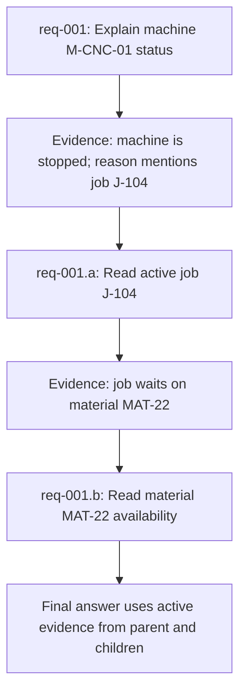
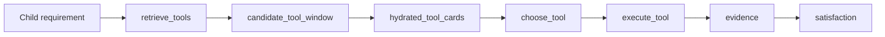

# Planner-Owned Requirement Expansion Plan

## Purpose

Plan 1 made the planner-owned graph recover after weak, missing, stale, or failed evidence. The retry UX work made that recovery visible and understandable. The next hard-case weakness is earlier in the loop: the system can still be anchored to the first requirement split and label.

This plan adds evidence-driven child requirements so the graph can safely expand the requirement ledger after observations reveal a new need. The goal is not to make the LLM an unrestricted runtime controller. The goal is to let the planner add bounded follow-up requirements while deterministic guards preserve user-stated facts, approval safety, and final evidence integrity.

## Suitability Check

Plan 2 is still the right next plan.

| Check | Finding |
|---|---|
| Plan 1 scope explicitly deferred child requirements | `docs/qa/PLANNER_OWNED_REPLAN_SPINE_PLAN.md` lists child requirements as saved for Plan 2. |
| Replan spine now gives a safe moment to reconsider | Missing evidence reasons, failed-tool memory, and bounded replan diagnostics already exist. |
| Current ledger has revision machinery | `RequirementLedger` has `revision` and `revision_history`; planner decisions already support `revise_requirements`. |
| Current requirement entry has no child lineage | `RequirementLedgerEntry` has `depends_on` and `superseded_by`, but no explicit parent/child expansion contract. |
| Locked constraints are already protected | Decision validation rejects dropped or changed locked constraints. Plan 2 should extend that protection to child expansion. |
| Plan 3 should wait | Execution dependency labels are more useful after child requirements exist. Plan 2 should only use minimal parent/child dependency metadata, not full parallel/sequential policy. |

Conclusion: implement Plan 2 now, but narrow it to **evidence-driven child requirement expansion**. Do not broaden it into full dependency scheduling or pure ReAct.

## Problems This Plan Solves

| Problem | Current Behavior | Target Behavior |
|---|---|---|
| Wrong initial split | Initial deterministic requirements remain the main shape of the run. | Evidence can justify adding bounded child requirements. |
| Wrong requirement label | A weak label can narrow tool retrieval too early. | Missing evidence can trigger a better child requirement with a clearer source-of-truth and entity. |
| Over-locked inferred details | Inferred fields/labels may become too sticky. | User-stated facts stay locked; planner-inferred expansion details remain guarded and revisable. |
| Tool narrowing from weak requirement | Replan can retry tools but cannot redesign the need. | Replan can add a child need and retrieve tools for that child. |
| Root-cause investigation branches | The graph can answer status, but not naturally branch into why. | Observation can create follow-up requirements such as status -> active job -> material/maintenance cause. |

## Non-Goals

- Do not convert the whole graph to pure ReAct.
- Do not let the planner drop or weaken locked user constraints.
- Do not bypass approval gates for write or mutation requirements.
- Do not add full Plan 3 execution dependency labels.
- Do not build a new tool selector, RAG stack, approval system, or response renderer.
- Do not rely on exact prompt text, seeded IDs, tool names, or UI strings in production logic.
- Do not make real LLM calls mandatory for the main test suite.

## Target Model

Child requirements are ledger entries created after evidence shows that the original requirement needs a bounded follow-up.

Example:



Minimum contract:

- Child requirement has a stable child id, for example `req-001.a`.
- Child requirement references its parent requirement.
- Child requirement records why it was created.
- Child requirement records evidence refs or missing-evidence reasons that justified expansion.
- Child requirement can depend on parent evidence without introducing full Plan 3 scheduling policy.
- Original locked user constraints remain preserved on the original requirement.
- Child constraints cannot contradict parent locked constraints.

## Requirement-To-Tool State Policy

This policy is in scope for Plan 2. A new child requirement must go through the same requirement-to-tool path as an initial requirement:



The graph must not silently reuse the parent requirement's selected tool, candidate window, or hydrated cards as the child's executable state.

State rules:

| State Item | Keep | Remove / Mark Stale | Reason |
|---|---:|---:|---|
| Parent requirement | Yes | No, unless superseded | Parent remains the original user-facing need. |
| Parent active evidence | Yes, if still relevant | Mark stale only if contradicted or superseded | Parent evidence can justify child expansion and support final answer. |
| Parent candidate window / hydrated cards | Usually yes for audit, but not executable for child | Remove if parent requirement is being retried or superseded | Tool windows are requirement-scoped and must not authorize child execution. |
| Parent planner decisions | Keep for audit | Mark stale if tied to superseded/retried requirement revision | Old decisions must not authorize new requirement execution. |
| New child requirement | Yes | No | Child starts open and needs its own retrieval. |
| Child candidate window / hydrated cards | Created fresh | Remove on child retry/supersede | Child tool search must use the same retrieval logic as initial requirements. |
| Satisfied requirement candidate window / hydrated cards | Keep only as audit/history | Remove from executable selection | Done requirements should not run more tools unless reopened by a new revision. |
| Blocked or failed requirement tools | Keep only as diagnostics/audit | Remove from executable selection | Failure context is useful, but must not authorize repeated execution. |
| Superseded requirement's tools | No executable reuse | Remove or mark stale | Prevents stale tool selection from leaking across revisions. |
| Removed requirement's tools | No executable reuse | Remove from active state or archive in revision diagnostics | A deleted requirement cannot authorize future execution. |
| Failed tool memory | Keep by requirement and attempt | Do not apply to unrelated child unless signatures/constraints match | Avoid repeating bad calls without blocking valid child tools. |

Acceptance rule: after adding a child requirement, the next executable tool call for that child must be produced from a child-scoped `retrieve_tools -> candidate window -> hydrated cards -> choose_tool` chain.

Executable tool invariant:

```text
A selected tool call can execute only when:
1. its requirement_id points to an active/open requirement,
2. its decision ledger_revision matches the current requirement ledger revision,
3. its candidate window is active for that same requirement,
4. its hydrated card is active for that same requirement,
5. the decision was made after the current requirement revision began.
```

Audit retention rule: recommended tools, hydrated cards, selected calls, and failed calls may stay in diagnostics or revision history after a requirement is done, failed, blocked, removed, or superseded, but they must not remain in the active executable set.

## Phase 0: Baseline Proof

### Goal

Prove the current graph cannot safely expand requirements after evidence reveals a new investigation branch.

### Red Test

Add a backend graph regression test that simulates:

1. User asks a status-plus-cause question.
2. Initial requirement reads the machine status.
3. Evidence reveals a new concrete follow-up need, such as active job, alarm, material, or maintenance cause.
4. Current graph retries or finalizes without adding a child requirement.

Suggested test name:

```text
test_requirement_expansion_baseline_missing_child_requirement_after_cause_evidence
```

### Expected Failure

The test should fail because no child requirement is added and no second bounded requirement is executed.

### Exit Criteria

- The failing test proves the requirement expansion gap.
- Existing Plan 1 replan-spine tests still pass or are not changed.

## Phase 1: Child Requirement Contract

### Goal

Add the smallest durable contract for child requirements.

### Work

- Extend the requirement contract with child lineage fields, such as:
  - `parent_requirement_id`
  - `expansion_reason`
  - `derived_from_evidence_refs`
  - `derived_from_missing_reasons`
- Keep `depends_on` for existing dependency references, but do not implement Plan 3 dependency labels yet.
- Add a deterministic child id helper, for example `req-001.a`, `req-001.b`.
- Store expansion details in `RequirementRevisionRecord.details`.

### Tests

- Contract serialization test proves child fields survive model dump/load.
- Revision record test proves child creation records:
  - parent requirement id
  - added child requirement ids
  - evidence refs or missing reasons
  - locked constraints preserved

### Exit Criteria

- Child requirements are serializable, deterministic, and auditable.

## Phase 2: Decision-Gate Validation

### Goal

Make child expansion safe at the planner decision gate.

### Work

Extend `revise_requirements` validation so a proposed ledger may add child requirements only when all guards pass:

- Existing original requirements are still present.
- Existing locked constraints and locked values are preserved.
- Child parent id points to an existing active requirement.
- Child requirement ids follow the child id convention.
- Child constraints do not contradict parent locked constraints.
- Child source-of-truth and entity are supported by evidence, missing-evidence reasons, or parent requirement context.
- Child mutation requirements remain approval-gated.
- Child expansion is rejected if it appears arbitrary or unrelated to the current evidence gap.
- Selected tool calls are executable only for active/open requirements in the current ledger revision.
- Tool calls for satisfied, failed, blocked, removed, or superseded requirements are rejected or ignored as audit-only state.

### Tests

Add decision-contract tests for:

- Accept valid child requirement addition.
- Reject child addition that changes a parent locked value.
- Reject child addition with missing parent.
- Reject child addition with no evidence or missing-reason justification.
- Reject child mutation that bypasses approval safety.
- Accept child requirement with its own narrow locked constraints when they are evidence/user-supported.
- Reject selected tool calls for satisfied, removed, or superseded requirements.
- Reject selected tool calls from old ledger revisions after a requirement expansion.

### Exit Criteria

- The planner cannot add arbitrary requirements.
- Valid child requirements can pass the same decision gate used by real proposer output.

## Phase 3: Proposer Prompt And Adapter Support

### Goal

Let the planner propose child requirements through the existing proposer seam without seeing the full catalog or bypassing guards.

### Work

- Update the bounded proposer prompt for `revise_requirements`.
- Include only bounded state:
  - current requirement
  - all requirements
  - active evidence summary
  - missing evidence reasons
  - failed tool memory
  - candidate source-of-truth hints
  - child expansion rules
- Make the response contract explicit:
  - `proposed_requirement_ledger` must be complete.
  - Existing locked constraints must be preserved.
  - Child requirements must include lineage and justification.
  - The planner must not invent unrelated child requirements.
- Normalize proposer output so child fields and revision records are present before validation.

### Tests

- Proposer unit test proves the prompt includes child expansion rules and bounded evidence context.
- Proposer test proves malformed or unjustified child ledger is rejected.
- Proposer test proves valid child ledger with locked constraints preserved is accepted.
- Guardrail test proves no full OpenAPI catalog or hidden tool schemas are exposed.

### Exit Criteria

- Real planner/proposer output can request child expansion, but validation remains the authority.

## Phase 4: Graph Integration

### Goal

Wire accepted child requirements into the planner-owned graph loop.

### Work

- After satisfaction produces missing-evidence reasons or evidence reveals a follow-up need, allow `planner_decision_node` to request `revise_requirements`.
- Apply accepted child ledger revisions through the existing revision path.
- Clear or mark stale candidate windows that belonged to the previous revision when needed.
- Open child requirements for retrieval and tool choice.
- Force new child requirements through the normal retrieval path:
  - `planner_decision_node`
  - `tool_retrieval_node`
  - `planner_choose_tool_node`
  - `execute_tool_node`
- Prevent child requirements from executing with parent-scoped candidate windows, hydrated cards, or selected tool calls.
- Keep parent evidence as supporting evidence only when it is still active and relevant.
- Preserve active parent evidence as historical or supporting evidence, not stale failure, when it remains relevant.
- Ensure parent requirement finalization waits for required children when the answer depends on them.

### Tests

Add backend graph tests for:

- Evidence-driven child requirement is added after first observation.
- Child requirement retrieves and executes its own tool.
- Child requirement does not reuse the parent candidate window or hydrated cards as executable state.
- Superseded/retried requirement tool windows are removed or marked stale.
- Satisfied, failed, blocked, removed, or superseded requirement tool recommendations are retained only as audit/history, not executable state.
- Old selected tool calls from a previous ledger revision cannot execute after child expansion.
- Parent evidence can remain active as expansion support without satisfying the child by itself.
- Parent locked constraints are still preserved after child creation.
- Final response uses active evidence from parent and child.
- No finalization happens while a required child remains open.
- No infinite expansion loop; child expansion is bounded.

Suggested test name:

```text
test_requirement_expansion_adds_child_after_observation_and_finalizes_with_child_evidence
```

### Exit Criteria

- The graph can move from parent evidence to child requirement execution and then to a valid final answer.

## Phase 5: Satisfaction And Final Validation

### Goal

Make final validation understand child requirements without weakening current evidence checks.

### Work

- Child requirements use the existing satisfaction checks for their type.
- Parent requirements can cite child evidence when child requirements are part of the answer path.
- Final validation must fail if:
  - a required child is open
  - child evidence is missing
  - child evidence is stale
  - parent locked constraints were weakened
  - final response uses stale failed evidence instead of active child evidence
- Missing-evidence reasons should name whether the next gap is:
  - retry same requirement
  - refresh capability needs
  - add child requirement
  - request clarification

### Tests

- Satisfaction test proves a parent is not complete when required child is open.
- Satisfaction test proves child evidence can support the parent final answer.
- Final validation test proves stale child evidence is excluded.
- Regression test proves simple read still finalizes without child requirements.
- Regression test proves no-record behavior remains unchanged.
- Regression test proves RAG/document answer remains unchanged.

### Exit Criteria

- Child requirements improve hard investigations without making easy reads more complicated.

## Phase 6: API, Snapshot, And Persistence Contract

### Goal

Expose child requirement lineage in diagnostics and snapshots so future UI/debug tooling can explain the investigation path.

### Work

- Persist child requirement fields in the intent contract.
- Include child lineage in session snapshots or response diagnostics:
  - parent requirement id
  - child requirement ids
  - expansion reason
  - derived evidence refs
  - ledger revision
- Preserve compatibility for older sessions without child fields.

### Tests

- API contract test proves child requirement lineage survives persistence/reload.
- Snapshot test proves response document and intent contract agree on active final evidence refs.
- Compatibility test proves old snapshots without child fields still render.

### Exit Criteria

- Child requirements are auditable after the run, not just during graph execution.

## Phase 7: Seeded E2E And Browser Proof

### Goal

Prove the behavior through the seeded stack when feasible.

### Preferred Seeded Scenario

```text
HQ-REQUIREMENT-EXPANSION-ROOT-CAUSE
```

Scenario shape:

1. User asks why a machine is not running or why a job is delayed.
2. First read returns a status with a concrete follow-up clue.
3. Planner adds a child requirement.
4. Child requirement reads the follow-up entity.
5. Final answer uses active evidence from both parent and child.

### E2E Assertions

- UI reaches completed state.
- Snapshot/intent contract includes child requirement lineage.
- Final answer uses active child evidence.
- Parent locked constraints remain unchanged.
- No stale failed evidence is shown as final.
- The run does not require approval unless a child mutation is proposed.

### If Seeded Scenario Is Not Feasible

Document why, then make backend graph/API coverage explicit and strong. Do not create a fake production shortcut to make the seeded test pass.

### Exit Criteria

- Seeded Playwright passes if fixture support exists.
- Browser validation confirms the child requirement path or documents the fixture gap.

## Phase 8: Final Regression Gate

### Backend Gates

```powershell
cd "C:\Users\dilun\OneDrive\Documents\eMas APi\factory-agent"
python -m pytest tests/test_planner_owned_graph_execution_observation.py tests/test_planner_owned_satisfaction.py tests/test_planner_owned_graph_api_contract.py -q
python -m pytest tests/test_planner_owned_graph_llm_proposer.py tests/test_planner_owned_graph_decision_contract.py -q
python -m pytest tests/test_planner_owned_graph_runtime_adapter.py tests/test_hardcode_guardrails.py::test_frontend_phrase_based_state_fallbacks_stay_allowlisted -q
```

### Frontend/Seeded Gate

Run only if snapshot/UI contracts changed:

```powershell
cd "C:\Users\dilun\OneDrive\Documents\eMas APi\eMas Front"
node --test --test-concurrency=1 .\tests\FactoryAgentChatPanel.component.test.mjs .\tests\responseDocumentProbe.test.mjs
npm run test:e2e -- --project=chromium-seeded --grep "HQ-REQUIREMENT-EXPANSION|HQ-REPLAN-SPINE"
```

### Browser Validation

Use Browser or headed Playwright to confirm:

- Child requirement lineage is present in snapshot/intent contract.
- Final answer uses active evidence from the child path.
- Existing replan-spine recovery and safe-failure scenarios still behave correctly.
- No misleading retry/failure UI text regresses.

## Phase Coverage

| Risk | Covered By | Proof |
|---|---|---|
| Wrong initial split | Phases 0, 4, 5 | Graph test adds child after evidence shows new need |
| Wrong requirement label | Phases 2, 3, 4 | Decision/proposer tests allow bounded revised child label |
| Over-locked inferred details | Phases 1, 2, 5 | Validation preserves user locks and rejects contradictory child constraints |
| Tool narrowing from weak req | Phases 3, 4 | Child capability retrieval uses new bounded child requirement |
| Root-cause branch | Phases 4, 7 | Backend and seeded/browser proof where feasible |
| Regression of simple paths | Phases 5, 8 | Simple read, no-record, RAG, approval gates remain green |

## Recommended Commit Plan

- Commit Phase 0 only if it adds useful failing baseline tests.
- Commit Phase 1 after child contract serialization tests pass.
- Commit Phase 2 after decision-gate tests pass.
- Commit Phase 3 after proposer tests pass.
- Commit Phase 4 after graph integration tests pass.
- Commit Phase 5 after satisfaction/final validation tests pass.
- Commit Phase 6 after API/snapshot persistence tests pass.
- Commit Phase 7/8 after Playwright/browser validation passes.

## Final Definition Of Done

Plan 2 is done when a hard investigation can safely grow from one original requirement into bounded child requirements, execute those children, and finalize using active evidence while preserving locked user facts and approval safety.

Final verdict should be:

- **PASS** when backend graph/API tests, decision/proposer tests, seeded or documented E2E proof, and browser validation all pass.
- **ACCEPTABLE WITH RISKS** when seeded fixture support cannot represent child expansion, but backend/API coverage proves the generic behavior strongly.
- **BLOCKED** when child expansion can bypass locked constraints, approval gates, or final evidence validation.
