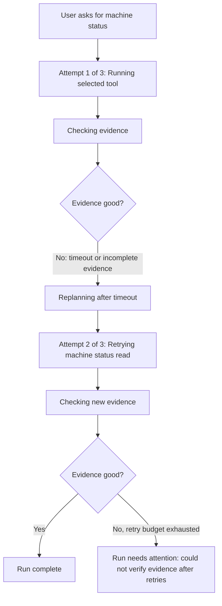

# Replan Spine Retry UX Clarity Plan

## Purpose

The replan spine can now retry, replan, and fail safely, but the current chat UI does not explain that behavior clearly enough. During retries, the user can see repeated generic steps, moving current markers, timeout banners that compete with terminal results, and failure wording that makes an expected diagnostic failure look like an app failure.

This plan fixes the user-facing retry and safe-failure experience phase by phase, with tests proving each behavior before development continues.

## Scope

In scope:

- Retry and replan activity timeline clarity.
- Terminal failure wording after execution has already started.
- Timeout banner behavior when a terminal diagnostic result exists.
- Attempt numbers, retry reasons, and collapse behavior for noisy retries.
- Playwright/browser validation for seeded replan-spine recovery and safe-failure scenarios.

Out of scope:

- Changing the core replan-spine planner behavior unless the UI lacks structured data needed to render truthful events.
- Adding new hard-query capabilities.
- Implementing later roadmap plans beyond retry UX clarity.

## Guiding Rules

- Use typed state, event fields, and diagnostics whenever available. Do not rely on fragile phrase matching.
- Do not hardcode seeded scenario IDs, prompt text, machine IDs, or tool names in production UI logic.
- Tests must verify user-observable behavior through public UI/API surfaces.
- Add tests vertically: one failing behavior test, implement, make it pass, then move to the next behavior.
- If backend data is not expressive enough for truthful UX, add structured response/session diagnostics instead of making the frontend guess.
- Commit after each completed phase if the phase has a clean test gate.

## Problem List

| # | Problem | What User Sees | Why It Is Bad | Fix Direction |
|---|---|---|---|---|
| 1 | Steps reorder during retry | `Running selected tool` and `Checking result` swap positions | Feels like the timeline is moving backward | Make activity timeline append-only |
| 2 | Same generic labels repeat | Many rows say `Preparing next action` | User cannot tell what changed | Use specific labels like `Replanning after timeout` |
| 3 | No attempt number | User sees many loops but no count | Looks infinite or broken | Show `Attempt 1 of 3`, `Attempt 2 of 3` |
| 4 | Retry reason is hidden | It just says `Running selected tool` again | User does not know why retry happened | Show reason like `Previous read timed out` |
| 5 | Current marker jumps | `Current` moves between old-looking steps | Feels unstable | Only latest active event should be current |
| 6 | Too many visible rows | 5 replans creates many activity updates | UI feels noisy and scary | Collapse or summarize old attempts |
| 7 | Timeout banner competes with final result | Top says timed out while card has diagnostic result | User sees two different causes | Show timeout banner only while state is unknown/running |
| 8 | `Request could not start` is wrong after execution begins | Response says request could not start | Tool/replan already happened | Use `Run could not complete` or `Run needs attention` |
| 9 | Technical error leaks too early | `planner_no_action` shown as main text | Too internal for normal user | Put technical code under `Technical details` |
| 10 | Safe failure looks like app failure | `request timed out` / `could not start` | Correct safe failure looks broken | Use diagnostic wording |
| 11 | Retry budget is too high for UI | 5 replans feels like many loops | Looks stuck even when bounded | Use 2-3 visible attempts or collapse older attempts |
| 12 | No distinction between retrying and replanning | Both appear as generic backend action | User cannot understand agent behavior | Add separate `Replanning`, `Retrying tool`, and `Checking evidence` events |

## Target UX Flow



## Phase 0: Baseline Proof

### Goal

Prove the current UX problem exists before changing behavior.

### Covers

All 12 problems as baseline evidence.

### Work

- Run current seeded replan-spine scenarios.
- Capture screenshots and browser snapshots for:
  - Recovery after retry.
  - Safe failure after repeated timeout/http error.
- Add the first failing UI assertion for the most confusing behavior.

### First Failing Checks

- Safe-failure UI must not show `Request could not start` once execution has already produced tool/replan diagnostics.
- Terminal result must not compete with a top timeout banner.
- Retry timeline must show at least one attempt number.

### Suggested Commands

```powershell
cd "C:\Users\dilun\OneDrive\Documents\eMas APi\eMas Front"
npm run test:e2e -- --project=chromium-seeded --grep "HQ-REPLAN-SPINE"
```

### Exit Criteria

- At least one test fails for the expected current UX issue.
- Baseline screenshot/snapshot evidence is saved locally.

## Phase 1: Terminal Failure Clarity

### Goal

Make terminal safe failures look like diagnostic outcomes, not app startup failures.

### Covers

- #7 Timeout banner competes with final result.
- #8 `Request could not start` is wrong after execution begins.
- #9 Technical error leaks too early.
- #10 Safe failure looks like app failure.

### Work

- Show timeout banner only while session state is running, unknown, or waiting for backend confirmation.
- If a terminal response document exists, let it be the source of truth.
- Replace post-execution `Request could not start` with one of:
  - `Run needs attention`
  - `Run could not complete`
  - `Could not verify evidence after retries`
- Move technical codes such as `planner_no_action`, timeout codes, raw error JSON, and backend detail strings under `Technical details`.

### Tests

- Frontend component/unit test for terminal failure rendering.
- Response document probe test for safe-failure wording.
- Seeded Playwright safe-failure assertion:
  - Shows `Run needs attention`.
  - Shows diagnostic wording.
  - Does not show `Request could not start`.
  - Does not show raw technical code as primary text.
  - Does not show a competing timeout banner after terminal result is present.

### Exit Criteria

- Safe-failure terminal screen has one clear cause.
- Technical details are still available, but not promoted as primary user text.

## Phase 2: Append-Only Activity Timeline

### Goal

Make the timeline stable so retry/replan progress does not look like it moves backward.

### Covers

- #1 Steps reorder during retry.
- #5 Current marker jumps.
- #12 No distinction between retrying and replanning.

### Work

- Preserve event order once displayed.
- Render completed historical events before newer active events.
- Ensure only the newest active event shows `Current`.
- Add separate event categories where structured data supports them:
  - `Checking evidence`
  - `Replanning`
  - `Retrying tool`
  - `Running selected tool`

### Tests

- Activity timeline unit test with a retry/replan event sequence.
- Assert the displayed order remains append-only.
- Assert exactly one event is marked current.
- Assert old completed rows do not move when a new retry event arrives.

### Exit Criteria

- Timeline no longer swaps `Running selected tool` and `Checking result`.
- Current marker appears only on the latest active event.

## Phase 3: Human-Readable Retry Story

### Goal

Make the user understand why the agent is retrying and what changed between attempts.

### Covers

- #2 Same generic labels repeat.
- #3 No attempt number.
- #4 Retry reason is hidden.
- #12 No distinction between retrying and replanning.

### Work

- Show attempt numbers:
  - `Attempt 1 of 3`
  - `Attempt 2 of 3`
  - `Attempt 3 of 3`
- Show retry reasons:
  - `Previous read timed out`
  - `Evidence was incomplete`
  - `Trying a different tool`
- Replace repeated generic labels with specific labels:
  - `Replanning after timeout`
  - `Retrying machine status read`
  - `Checking new evidence`
- Use backend structured missing-evidence reasons and failed-tool memory when available.

### Tests

- Seeded recovery E2E asserts:
  - attempt numbers are visible
  - retry reason is visible
  - final answer still uses active evidence only
- Seeded safe-failure E2E asserts:
  - final attempt count is visible
  - safe-failure wording is visible
  - stale failed evidence is not presented as success

### Exit Criteria

- A user can tell the difference between first attempt, replan, retry, evidence check, and terminal outcome.

## Phase 4: Noise Control And Retry Budget

### Goal

Keep hard-case retry behavior useful without making the UI feel stuck.

### Covers

- #6 Too many visible rows.
- #11 Retry budget is too high for UI.

### Work

- Collapse older retry attempts when many attempts exist.
- Show a compact summary such as:
  - `2 earlier attempts collapsed`
- Keep the latest attempt expanded.
- Keep the terminal diagnostic expanded.
- Prefer a separate visible retry budget or display policy over changing global planner retry behavior.
- If product behavior allows it, consider a replan-spine-specific retry budget of 2-3 total visible attempts.

### Tests

- Timeline unit test with more than 3 attempts.
- Assert older attempts collapse into a summary.
- Assert the latest attempt and final diagnostic remain visible.
- Playwright safe-failure test confirms the UI does not show a long scary repeated list.

### Exit Criteria

- Safe-failure screen remains compact and readable even when backend diagnostics contain many attempts.

## Phase 5: Final Browser Validation

### Goal

Prove the full UX in the real browser before moving to the next feature.

### Required Automated Gates

Run the relevant backend tests if any response/session contract changed:

```powershell
cd "C:\Users\dilun\OneDrive\Documents\eMas APi\factory-agent"
python -m pytest tests/test_planner_owned_graph_execution_observation.py tests/test_planner_owned_satisfaction.py tests/test_planner_owned_graph_api_contract.py -q
```

Run focused frontend unit/component tests:

```powershell
cd "C:\Users\dilun\OneDrive\Documents\eMas APi\eMas Front"
node --test --test-concurrency=1 .\tests\activityTimeline.test.mjs .\tests\FactoryAgentChatPanel.component.test.mjs .\tests\responseDocumentProbe.test.mjs
```

Run seeded Playwright proof:

```powershell
cd "C:\Users\dilun\OneDrive\Documents\eMas APi\eMas Front"
npm run test:e2e -- --project=chromium-seeded --grep "HQ-REPLAN-SPINE"
```

### Manual Browser Checks

Use Browser/Playwright against the seeded stack and confirm:

- Recovery scenario:
  - Timeline order is stable.
  - Attempt numbers are visible.
  - Retry reason is visible.
  - Only latest active event has `Current`.
  - Final result says the machine is running based on active evidence.
- Safe-failure scenario:
  - Screen says `Run needs attention`.
  - It explains evidence could not be verified after retries.
  - It does not show `Request could not start`.
  - It does not show a competing timeout banner after terminal result.
  - Technical codes are inside `Technical details`.
  - Old attempts are collapsed or summarized if noisy.

### Exit Criteria

- All automated gates pass.
- Browser/manual validation confirms both recovery and safe-failure UX.
- Screenshots are captured for before/after comparison.

## Problem-To-Phase Coverage Check

| Problem # | Covered In | Required Proof |
|---|---|---|
| 1 | Phase 2 | Timeline unit test proves append-only order |
| 2 | Phase 3 | E2E proves specific retry/replan labels |
| 3 | Phase 3 | E2E proves attempt numbers are visible |
| 4 | Phase 3 | E2E proves retry reason is visible |
| 5 | Phase 2 | Unit test proves only latest active event is current |
| 6 | Phase 4 | Unit/E2E proves old attempts collapse or summarize |
| 7 | Phase 1 | E2E proves no terminal timeout-banner conflict |
| 8 | Phase 1 | E2E proves no post-execution `Request could not start` |
| 9 | Phase 1 | Component test proves technical code is under details |
| 10 | Phase 1 | E2E proves diagnostic wording replaces app-failure wording |
| 11 | Phase 4 | Unit/E2E proves retry UI is compact under repeated attempts |
| 12 | Phase 2 and Phase 3 | Unit/E2E proves separate replan, retry, and evidence-check events |

## Recommended Commit Plan

- Commit Phase 0 only if it adds useful failing tests or baseline docs.
- Commit Phase 1 after terminal failure clarity tests pass.
- Commit Phase 2 after append-only timeline tests pass.
- Commit Phase 3 after retry story tests pass.
- Commit Phase 4 after noise-control tests pass.
- Commit Phase 5 after final Playwright/browser validation passes.

## Final Definition Of Done

The feature is done when the user can watch a retrying run and understand:

1. What attempt the agent is on.
2. Why the previous attempt was not enough.
3. Whether the agent is replanning, retrying a tool, or checking evidence.
4. Whether the run completed successfully or safely failed.
5. Where to find technical details without those details dominating the normal UI.
