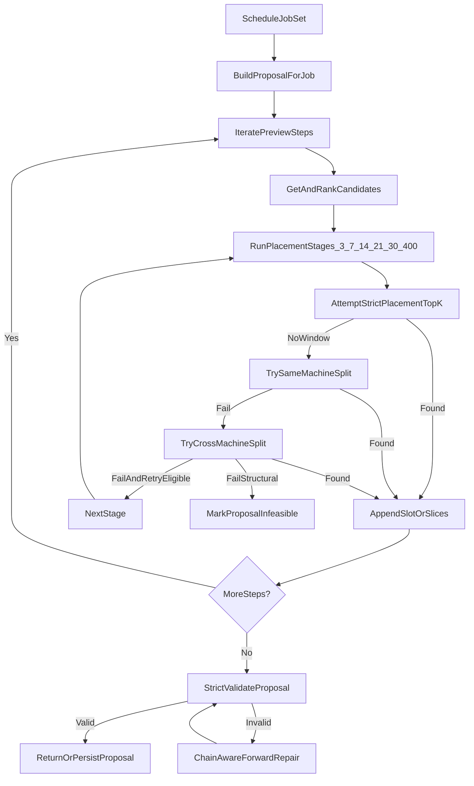

# Scheduling Algorithm Design

This document describes how proposal generation works in `AIPredictiveService` and how horizon/lateness stages are applied.

## Short answer on horizon cap

The scheduler now uses a **hybrid cap anchor**:

- `now + stageHorizonDays` (runtime safety bound),
- `effectiveDeadline + buffer` (deadline/lateness aware),
- `adaptiveEnd` (cursor + target/deadline aware envelope).

Effective stage cap:

`stageCap = min(now+stageHorizon, effectiveDeadline+buffer, adaptiveEnd)`, then clamped to `>= start`.

## Key code paths

- Main generation loop: `internal/service/heuristic_strategies.go`
- Batch orchestration and strict validation/repair: `internal/service/multi_job_scheduler.go`
- Slot feasibility checks and calendar/resource constraints: `internal/service/scheduling_service.go` and `internal/service/scheduling_support.go`

## End-to-end flow

1. `ScheduleJobSet` selects jobs and builds proposal snapshots.
2. For each job, heuristic generation runs step-by-step.
3. For each step:
   - Build candidate machines.
   - Rank candidates (tiered heuristic + earliest finish pool).
   - Attempt strict placement on top-K machines.
   - If no continuous window, try same-machine split fallback.
   - If still no window, escalate through staged horizon/lateness profile.
4. If a proposal is invalid, chain-aware repair may move conflicting steps forward.
5. Strict slot validation is applied before proposal is returned/persisted.

## Stage profile

Current staged placement profile:

- Stage 1: horizon 3d, lateness 0d
- Stage 2: horizon 7d, lateness 2d
- Stage 3: horizon 14d, lateness 7d
- Stage 4: horizon 21d, lateness 14d
- Stage 5: horizon 30d, lateness 30d
- Stage 6: horizon 400d, lateness 400d (hard ceiling)

## Horizon math

For each step, the scheduler computes:

1. `adaptiveEnd = computeAdaptiveHorizonEnd(now, effectiveDeadline, targetCompletion, stepCursor, hp)`
2. `stageCap = min(now + stageHorizonDays, effectiveDeadline + buffer, adaptiveEnd)`
3. `stageCap = max(stageCap, start)` to avoid backward caps

Where `effectiveDeadline = job.Deadline + stageLatenessDays`.

This means:

- Deadline and lateness can push search later.
- Search remains bounded by stage cap from `now`.
- Deadline+lateness still constrains search in late stages via hybrid anchoring.
- Across stages, the cap can expand up to 400 days.

## Strict placement behavior

For each stage:

- Try top-K machines (`topKMachines`, currently 5).
- For each attempted machine:
  - Find feasible start respecting:
    - machine work windows,
    - global scheduling template,
    - resource calendars,
    - busy slots/downtime/maintenance,
    - precedence constraints.
  - If no continuous window, try split slices on same machine with guardrails:
    - max slices,
    - min slice duration,
    - coverage completeness,
    - no overlaps.
  - If still no fit, try deterministic cross-machine split packing across attempted machines.
- Early-exit is softened:
  - requires a minimum number of attempts,
  - no-window early exit is only allowed on final stage.

## Why infeasible can still happen at 400d

Even with 400-day cap, a step may remain infeasible when:

- top-K candidate machines are too limited,
- calendar/resource windows are too fragmented,
- duration cannot fit continuous windows,
- split limits still cannot cover required duration, even with cross-machine fallback,
- structural constraints (precedence/overlap/calendar) block all attempts.

## Observability fields

When blocked, the reason includes:

- `reason_code=no_feasible_window`
- `horizon_end=<timestamp>`
- `placement_expanded_steps=<n>`

Logs also include machine attempt diagnostics and stage metadata (`stages_tried`, selected machine, signatures, diagnostics map).

## Mermaid overview

