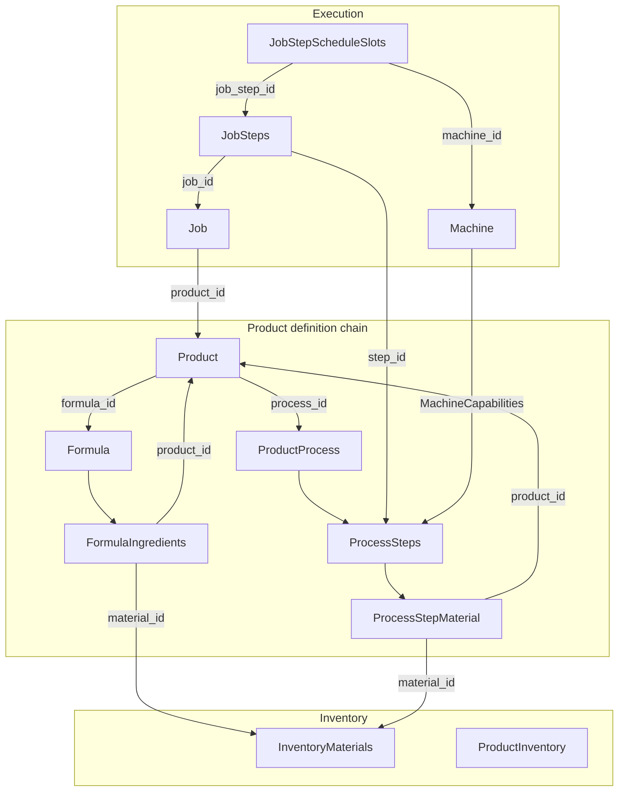

# Seed Entity Relationships

Documentation of entity relationships, consistency rules, and allocation logic for the eMas seed data.

## Entity Relationship Diagram

## Key Relationships and Consistency Rules

| Relationship | Rule |
|--------------|------|
| **Formula ↔ ProcessStepMaterial** | For each product: sum of ProcessStepMaterial input quantities (by material/product) must equal Formula ingredient quantities per unit |
| **Formula ↔ ProductBOM** | ProductBOM duplicates Formula when product has FormulaID. Scheduler prefers Formula. |
| **ProcessStepMaterial ↔ ProcessSteps** | Every step_id must exist in process_steps |
| **Job → Product → Process** | Job.product_id must have valid process with steps |
| **WIPInventory → JobSteps** | JobStepID must exist before WIP seeded |
| **MachineCapabilities → ProcessSteps** | Every step_id in capabilities must exist |
| **StepResourceRequirement → ProcessSteps** | step_id must exist |
| **InventoryReservation → Job** | job_id must exist |

## Allocation Logic: Formula Ingredient → Step

- **Raw materials** (component_type=material): Allocate to first step that consumes them. For multi-step processes: machining steps consume bulk materials; coating step consumes coating material.
- **Sub-products** (component_type=product): Allocate to assembly/final step.
- **Output:** Final assembly step produces the product (ProcessStepMaterial role=output).

## Seed Order (Dependencies)

1. Reference data
2. Machines
3. Formulas and FormulaIngredients (before Products)
4. Processes and ProcessSteps (before Products)
5. Products (references FormulaID, ProcessID)
6. Materials (inventory_materials)
7. ProcessStepGaps, Capabilities, Setup, Resources
8. ProcessStepMaterials (needs processes, steps, materials, products)
9. ProductBOM (derived from Formula)
10. Expected arrivals, Product inventory, Reservations
11. Jobs, WIP, Proposals, Logs, Quality, Maintenance

## ProcessStepMaterial Allocation by Product

| Product | Formula | Allocation |
|---------|---------|------------|
| P-001 | MAT-001, MAT-002, MAT-005, P-007, P-008 | MAT-001, MAT-002 → Step 1; MAT-005 → Step 4; P-007, P-008 → Step 5; Output P-001 → Step 5 |
| P-002 | MAT-003, MAT-006 | MAT-003, MAT-006 → Step 1 |
| P-003 | MAT-004, MAT-007 | MAT-004 → Step 1; MAT-007 → Step 2 |
| P-004 | MAT-008, MAT-012, P-007 | MAT-008, MAT-012 → Step 1; P-007 → Step 4 |
| P-005 | MAT-008, MAT-010, MAT-012 | All → Step 1 |
| P-006 | MAT-009, MAT-013, P-003, P-009 | MAT-009, MAT-013 → Step 1; P-003, P-009 → Step 3 |
| P-007 | MAT-010, MAT-011, MAT-014 | All → Step 1 |
| P-008 | MAT-002, MAT-004 | All → Step 1 |
| P-009 | MAT-011, MAT-014 | All → Step 1 |
