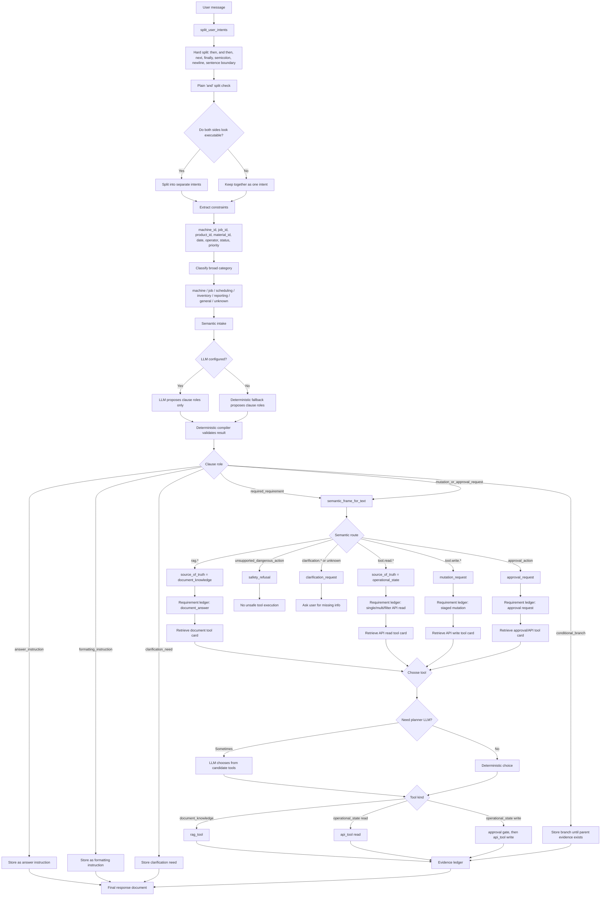

# Intent Splitter To Requirement Ledger Flow

This note explains how the current planner-owned v2 flow turns a user sentence into a requirement ledger.

The short version:

```text
User text
  -> splitter rules
  -> broad intent classification
  -> optional LLM semantic intake role proposal
  -> deterministic role validation/compiler
  -> semantic route
  -> requirement sketch
  -> requirement ledger
```

Important correction:

```text
The LLM does not directly create the final requirement ledger.
It may propose clause roles, but the deterministic compiler validates and converts those roles into ledger entries.
```

## Full Flow Chart



## Data Transformation View

Example user message:

```text
Show machine M-CNC-01 status and explain what it means, then summarize the LOTO procedure.
```

### 1. Raw User Text

```text
Show machine M-CNC-01 status and explain what it means, then summarize the LOTO procedure.
```

At this point there is only one raw string.

### 2. Splitter Output

The splitter first uses hard split rules:

```text
and then
then
next
after that
afterwards
finally
semicolon
newline
sentence boundary
```

Then it checks plain `and`. Plain `and` only splits when both sides look executable.

Result:

```json
[
  {
    "description": "Show machine M-CNC-01 status",
    "category": "machine",
    "explicit_constraints": [
      {
        "field": "machine_id",
        "operator": "=",
        "value": "M-CNC-01"
      }
    ]
  },
  {
    "description": "explain what it means",
    "category": "general",
    "explicit_constraints": []
  },
  {
    "description": "summarize the LOTO procedure",
    "category": "general",
    "explicit_constraints": []
  }
]
```

At this stage, the system knows:

```text
Clause 1 looks like a machine intent.
Clause 2 looks like a general answer instruction.
Clause 3 looks like a general/document question.
```

It has not yet made the final RAG/API/no-action decision.

### 3. Semantic Intake Role Proposal

Semantic intake decides the role of each clause.

If LLM semantic intake is configured, the LLM may propose these roles.
If no LLM is configured, or if the LLM result is invalid, deterministic fallback proposes them.

Either way, the deterministic compiler keeps authority.

```json
{
  "items": [
    {
      "text": "Show machine M-CNC-01 status",
      "role": "required_requirement",
      "reason": "needs live operational data"
    },
    {
      "text": "explain what it means",
      "role": "answer_instruction",
      "reason": "changes how the final answer should be written"
    },
    {
      "text": "summarize the LOTO procedure",
      "role": "required_requirement",
      "reason": "needs document knowledge retrieval"
    }
  ]
}
```

Meaning:

```text
required_requirement
  -> executable; can become API/RAG requirement

answer_instruction
  -> not executable; stored for final response generation

formatting_instruction
  -> not executable; stored for final response formatting

clarification_need
  -> not executable; ask user for missing information

conditional_branch
  -> not executable immediately; waits for parent evidence

mutation_or_approval_request
  -> executable, but likely requires approval
```

### 4. Semantic Frame For Executable Clauses

Only executable clauses continue into semantic routing.

Clause:

```text
Show machine M-CNC-01 status
```

Semantic frame:

```json
{
  "route": "tool.read.machine_status",
  "domain_intent": "machine_status",
  "action": "read",
  "entity": "machine",
  "source_of_truth": "operational_state",
  "missing_required_entities": []
}
```

Clause:

```text
summarize the LOTO procedure
```

Semantic frame:

```json
{
  "route": "rag.loto_procedure",
  "domain_intent": "loto_procedure",
  "action": "read",
  "entity": "procedure",
  "source_of_truth": "document_knowledge",
  "missing_required_entities": []
}
```

Clause:

```text
explain what it means
```

does not become a semantic frame for tool execution. It stays as:

```json
{
  "role": "answer_instruction",
  "tool_execution": false
}
```

### 5. Requirement Sketch

The requirement sketch is the intermediate structure before the final ledger.

```json
{
  "requirements": [
    {
      "goal": "Show machine M-CNC-01 status",
      "source_of_truth": "operational_state",
      "requirement_type": "single_entity_status",
      "intent_operation": "report_status",
      "entity": "machine",
      "constraints": {
        "machine_id": "M-CNC-01"
      }
    },
    {
      "goal": "summarize the LOTO procedure",
      "source_of_truth": "document_knowledge",
      "requirement_type": "document_answer",
      "intent_operation": "answer_document_question",
      "entity": "procedure",
      "constraints": {
        "safety_constraints": ["preserve safety requirements"]
      }
    }
  ],
  "answer_instructions": [
    {
      "text": "explain what it means"
    }
  ],
  "formatting_instructions": [],
  "clarification_needs": [],
  "conditional_branches": []
}
```

### 6. Requirement Ledger

The requirement ledger is the final tracked planning object.

```json
{
  "user_goal": "Show machine M-CNC-01 status and explain what it means, then summarize the LOTO procedure.",
  "requirements": [
    {
      "id": "req-001",
      "goal": "Show machine M-CNC-01 status",
      "requirement_type": "single_entity_status",
      "entity": "machine",
      "intent_operation": "report_status",
      "source_of_truth": "operational_state",
      "constraints": {
        "machine_id": "M-CNC-01"
      },
      "locked_constraints": ["machine_id"],
      "status": "open",
      "evidence_refs": [],
      "required": true
    },
    {
      "id": "req-002",
      "goal": "summarize the LOTO procedure",
      "requirement_type": "document_answer",
      "entity": "procedure",
      "intent_operation": "answer_document_question",
      "source_of_truth": "document_knowledge",
      "constraints": {
        "safety_constraints": ["preserve safety requirements"]
      },
      "locked_constraints": ["safety_constraints"],
      "status": "open",
      "evidence_refs": [],
      "required": true
    }
  ],
  "answer_instructions": [
    {
      "text": "explain what it means"
    }
  ],
  "formatting_instructions": [],
  "clarification_needs": [],
  "conditional_branches": [],
  "revision": 1
}
```

## Branch Examples

### API Read Branch

```text
User:
Show machine M-LTH-02 status.

Splitter:
["Show machine M-LTH-02 status"]

Category:
machine

Semantic route:
tool.read.machine_status

Source of truth:
operational_state

Requirement:
single_entity_status

Tool kind:
api_tool read
```

### RAG Branch

```text
User:
What does the PPE policy say?

Splitter:
["What does the PPE policy say?"]

Category:
general

Semantic route:
rag.safety_policy

Source of truth:
document_knowledge

Requirement:
document_answer

Tool kind:
rag_tool
```

### API Write Branch

```text
User:
Update JOB-ABC-123 priority to medium.

Splitter:
["Update JOB-ABC-123 priority to medium"]

Category:
job

Semantic route:
tool.write.jobs

Source of truth:
operational_state

Requirement:
mutation_request

Tool kind:
approval gate, then api_tool write
```

### Clarification Or No-Tool Branch

```text
User:
Read that job.

Splitter:
["Read that job"]

Category:
job

Semantic route:
tool.read.jobs

Problem:
"that job" has no bound job_id or previous referenced job.

Requirement:
none

Ledger:
clarification_need

Tool kind:
none
```

### Answer Instruction Branch

```text
User:
Show machine M-CNC-01 status and explain what it means.

Splitter:
[
  "Show machine M-CNC-01 status",
  "explain what it means"
]

Clause 1:
required_requirement -> API read

Clause 2:
answer_instruction -> no tool

Final behavior:
The system reads machine status, then explains the result in the final answer.
```

### Comparison Branch

```text
User:
Compare JOB-SEED-001 and JOB-SEED-002.

Splitter:
["Compare JOB-SEED-001 and JOB-SEED-002"]

Why not split on "and"?
Because this is a relationship/comparison request. The two IDs belong to one intent.

Requirement:
multi_entity_status

Tool kind:
api_tool read
```

## Where LLM Is Used

```text
Splitter:
No LLM currently. It is rule-based.

Semantic intake:
Optional LLM. It may propose clause roles.
The deterministic compiler still validates and owns the final conversion.

Planner tool choice:
Sometimes LLM. It may choose from candidate tool cards.

RAG answer generation:
May use LLM inside the document-answer pipeline.

Final summary or response writing:
May use LLM depending on configuration.
```

## Key Files

```text
factory-agent/factory_agent/planning/intent.py
  split_user_intents
  _split_clauses
  _split_plain_and_clauses
  _classify_clause
  semantic_frame_for_text

factory-agent/factory_agent/planning/semantic_intake.py
  semantic intake role proposal
  optional LLM proposer
  deterministic fallback

factory-agent/factory_agent/planning/v2_capability_map.py
  build_requirement_sketch_for_text
  _source_for_frame
  _requirement_shape_for
  build_requirement_ledger_from_sketch

factory-agent/factory_agent/planning/v2_contracts.py
  RequirementLedger
  RequirementLedgerEntry

factory-agent/factory_agent/graph/v2_graph_tool_choice.py
  rag_tool vs api_tool selection
```
